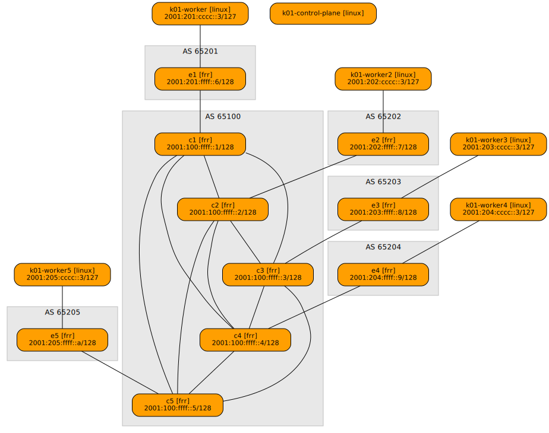

# Basic

## Description

This example demonstrates a five-node Kubernetes cluster connected through a simulated internet topology.

The topology consists of:
- **5 core routers (c1-c5)**: Fully meshed IPv6-only core using IS-IS routing protocol
- **5 edge routers (e1-e5)**: Provide connectivity to the core via BGP, simulating ISP infrastructure
- **5 Kubernetes worker nodes**: Each worker connects to one edge router to access the network


## Deploy

Before deploying, ensure you have completed the [base setup steps](../README.md).

Deploy the topology:
```bash
netlab up
```

This will create the network topology and Kubernetes cluster. Depending on your machine and bandwidth, pulling the required images may take several minutes.


## Test

The test manifest creates three pods across three regions (region1, region2, and region3) to demonstrate cross-region connectivity.

Each pod connects to a shared VPC with:
- Directly connected IPv4 subnet: `10.1.1.0/24`
- Directly connected IPv6 subnet: `2001:10:1:1::/64`
- Additional routed subnets configured for region1 and region3

### Create the Namespace

```bash
docker exec -it k01-control-plane kubectl create namespace test-basic
```

### Apply the VPC manifests

```bash
cat vpc.k8s.yml |docker exec -i k01-control-plane kubectl apply -f -
```

### Verify VPC deployment

```bash
docker exec -it k01-control-plane kubectl -n test-basic wait --for=jsonpath='{.status.ready}'=true vpc/main
docker exec -it k01-control-plane kubectl -n test-basic wait --for=jsonpath='{.status.ready}'=true vpcattachment/region1
docker exec -it k01-control-plane kubectl -n test-basic wait --for=jsonpath='{.status.ready}'=true vpcattachment/region2
docker exec -it k01-control-plane kubectl -n test-basic wait --for=jsonpath='{.status.ready}'=true vpcattachment/region3
```

### Apply the Pod manifests

```bash
cat deployment.k8s.yml |docker exec -i k01-control-plane kubectl apply -f -
```

### Verify Pod deployment

```bash
docker exec -it k01-control-plane kubectl -n test-basic rollout status deployment region1 && \
docker exec -it k01-control-plane kubectl -n test-basic rollout status deployment region2 && \
docker exec -it k01-control-plane kubectl -n test-basic rollout status deployment region3
```

### Test cross-region connectivity

Ping from region1 pod to region2 pod (10.1.1.2) to verify connectivity across the VPC:
```bash
docker exec -it k01-control-plane kubectl -n test-basic exec -it deploy/region1 -- ping 10.1.1.2
```

### Capture SRv6 traffic

While the ping is running, capture SRv6 encapsulated packets on core router c1 to observe the segment routing in action:
```bash
netlab capture c1 eth1 'net 2001:db8:ff00::/40'
```

You should see IPv6 packets with SRv6 headers routing traffic between regions through the simulated internet core.


## Topology




## Wiring

| Origin Device | Origin Port | Destination Device | Destination Port |
|---------------|-------------|--------------------|------------------|
| c1 | eth1 | c2 | eth1 |
| c1 | eth2 | c3 | eth1 |
| c1 | eth3 | c4 | eth1 |
| c1 | eth4 | c5 | eth1 |
| c2 | eth2 | c3 | eth2 |
| c2 | eth3 | c4 | eth2 |
| c2 | eth4 | c5 | eth2 |
| c3 | eth3 | c4 | eth3 |
| c3 | eth4 | c5 | eth3 |
| c4 | eth4 | c5 | eth4 |
| e1 | eth1 | c1 | eth5 |
| e2 | eth1 | c2 | eth5 |
| e3 | eth1 | c3 | eth5 |
| e4 | eth1 | c4 | eth5 |
| e5 | eth1 | c5 | eth5 |
| k01-worker | eth1 | e1 | eth2 |
| k01-worker2 | eth1 | e2 | eth2 |
| k01-worker3 | eth1 | e3 | eth2 |
| k01-worker4 | eth1 | e4 | eth2 |
| k01-worker5 | eth1 | e5 | eth2 |


## Addressing

| Node/Interface | IPv4 Address | IPv6 Address | Description |
|----------------|-------------:|-------------:|-------------|
| **c1** |   | 2001:100:ffff::1/128 | Loopback |
| eth1 |  | LLA | c1 -> c2 |
| eth2 |  | LLA | c1 -> c3 |
| eth3 |  | LLA | c1 -> c4 |
| eth4 |  | LLA | c1 -> c5 |
| eth5 |  | 2001:100:eeee::2/127 | c1 -> e1 |
| **c2** |   | 2001:100:ffff::2/128 | Loopback |
| eth1 |  | LLA | c2 -> c1 |
| eth2 |  | LLA | c2 -> c3 |
| eth3 |  | LLA | c2 -> c4 |
| eth4 |  | LLA | c2 -> c5 |
| eth5 |  | 2001:100:eeee::4/127 | c2 -> e2 |
| **c3** |   | 2001:100:ffff::3/128 | Loopback |
| eth1 |  | LLA | c3 -> c1 |
| eth2 |  | LLA | c3 -> c2 |
| eth3 |  | LLA | c3 -> c4 |
| eth4 |  | LLA | c3 -> c5 |
| eth5 |  | 2001:100:eeee::6/127 | c3 -> e3 |
| **c4** |   | 2001:100:ffff::4/128 | Loopback |
| eth1 |  | LLA | c4 -> c1 |
| eth2 |  | LLA | c4 -> c2 |
| eth3 |  | LLA | c4 -> c3 |
| eth4 |  | LLA | c4 -> c5 |
| eth5 |  | 2001:100:eeee::8/127 | c4 -> e4 |
| **c5** |   | 2001:100:ffff::5/128 | Loopback |
| eth1 |  | LLA | c5 -> c1 |
| eth2 |  | LLA | c5 -> c2 |
| eth3 |  | LLA | c5 -> c3 |
| eth4 |  | LLA | c5 -> c4 |
| eth5 |  | 2001:100:eeee::a/127 | c5 -> e5 |
| **e1** |   | 2001:201:ffff::6/128 | Loopback |
| eth1 |  | 2001:100:eeee::3/127 | e1 -> c1 |
| eth2 |  | 2001:201:cccc::2/127 | e1 -> k01-worker |
| **e2** |   | 2001:202:ffff::7/128 | Loopback |
| eth1 |  | 2001:100:eeee::5/127 | e2 -> c2 |
| eth2 |  | 2001:202:cccc::2/127 | e2 -> k01-worker2 |
| **e3** |   | 2001:203:ffff::8/128 | Loopback |
| eth1 |  | 2001:100:eeee::7/127 | e3 -> c3 |
| eth2 |  | 2001:203:cccc::2/127 | e3 -> k01-worker3 |
| **e4** |   | 2001:204:ffff::9/128 | Loopback |
| eth1 |  | 2001:100:eeee::9/127 | e4 -> c4 |
| eth2 |  | 2001:204:cccc::2/127 | e4 -> k01-worker4 |
| **e5** |   | 2001:205:ffff::a/128 | Loopback |
| eth1 |  | 2001:100:eeee::b/127 | e5 -> c5 |
| eth2 |  | 2001:205:cccc::2/127 | e5 -> k01-worker5 |
| **k01-control-plane** | 
| **k01-worker** | 
| eth1 |  | 2001:201:cccc::3/127 | k01-worker -> e1 |
| **k01-worker2** | 
| eth1 |  | 2001:202:cccc::3/127 | k01-worker2 -> e2 |
| **k01-worker3** | 
| eth1 |  | 2001:203:cccc::3/127 | k01-worker3 -> e3 |
| **k01-worker4** | 
| eth1 |  | 2001:204:cccc::3/127 | k01-worker4 -> e4 |
| **k01-worker5** | 
| eth1 |  | 2001:205:cccc::3/127 | k01-worker5 -> e5 |
