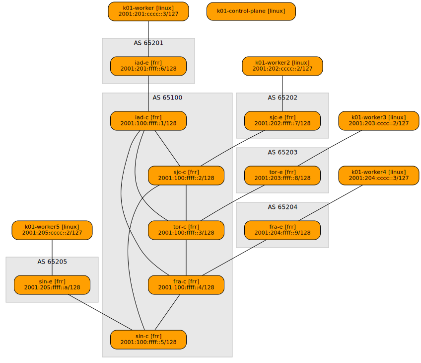

# Geo

## Description

This example demonstrates a five-node Kubernetes cluster connected through a simulated real-world internet topology including synthetic latencies.

The topology consists of:
- **5 core routers (c1-c5)**: Connected in a global IPv6-only core using IS-IS routing protocol
  - IAD, Washington DC, US
  - SJC, San Jose, US
  - TOR, Toronto, CA
  - FRA, Frankfurt, DE
  - SIN, Singapore, SG
- **5 edge routers (e1-e5)**: Provide connectivity to the core via BGP, simulating ISP infrastructure
- **5 Kubernetes worker nodes**: Each worker connects to one edge router to access the network


## Deploy

Before deploying, ensure you have completed the [base setup steps](../README.md).

Deploy the topology:
```bash
netlab up
```

This will create the network topology and Kubernetes cluster. Depending on your machine and bandwidth, pulling the required images may take several minutes.


## Test

The test manifest creates three pods across three regions (TOR, SJC, and SIN) to demonstrate cross-region connectivity.

Each pod connects to a shared VPC with:
- Directly connected IPv4 subnet: `10.1.1.0/24`
- Directly connected IPv6 subnet: `2001:10:1:1::/64`
- Additional routed subnets configured for TOR and SIN

### Create the Namespace

```bash
docker exec -it k01-control-plane kubectl create namespace test-geo
```

### Apply the VPC manifests

```bash
cat vpc.k8s.yml |docker exec -i k01-control-plane kubectl apply -f -
```

### Verify VPC deployment

```bash
docker exec -it k01-control-plane kubectl -n test-geo wait --for=jsonpath='{.status.ready}'=true vpc/main
docker exec -it k01-control-plane kubectl -n test-geo wait --for=jsonpath='{.status.ready}'=true vpcattachment/tor
docker exec -it k01-control-plane kubectl -n test-geo wait --for=jsonpath='{.status.ready}'=true vpcattachment/sjc
docker exec -it k01-control-plane kubectl -n test-geo wait --for=jsonpath='{.status.ready}'=true vpcattachment/sin
```

### Apply the Pod manifests

```bash
cat deployment.k8s.yml |docker exec -i k01-control-plane kubectl apply -f -
```

### Verify Pod deployment

```bash
docker exec -it k01-control-plane kubectl -n test-geo rollout status deployment tor && \
docker exec -it k01-control-plane kubectl -n test-geo rollout status deployment sjc && \
docker exec -it k01-control-plane kubectl -n test-geo rollout status deployment sin
```

### Test cross-region connectivity

Ping from TOR pod to SJC pod (10.1.1.2) to verify connectivity across the VPC:
```bash
docker exec -it k01-control-plane kubectl -n test-geo exec -it deploy/tor -- ping 10.1.1.2
```

### Capture SRv6 traffic

While the ping is running, capture SRv6 encapsulated packets on core router c1 to observe the segment routing in action:
```bash
netlab capture tor-c eth2 -n 'net 2001:db8:ff00::/40'
```

You should see IPv6 packets with SRv6 headers routing traffic between regions through the simulated internet core.


## Topology




## Wiring

| Origin Device | Origin Port | Destination Device | Destination Port |
|---------------|-------------|--------------------|------------------|
| iad-c | eth1 | sjc-c | eth1 |
| iad-c | eth2 | tor-c | eth1 |
| iad-c | eth3 | fra-c | eth1 |
| sjc-c | eth2 | tor-c | eth2 |
| sjc-c | eth3 | sin-c | eth1 |
| tor-c | eth3 | fra-c | eth2 |
| fra-c | eth3 | sin-c | eth2 |
| iad-e | eth1 | iad-c | eth4 |
| sjc-e | eth1 | sjc-c | eth4 |
| tor-e | eth1 | tor-c | eth4 |
| fra-e | eth1 | fra-c | eth4 |
| sin-e | eth1 | sin-c | eth3 |
| k01-worker | eth1 | iad-e | eth2 |
| k01-worker2 | eth1 | sjc-e | eth2 |
| k01-worker3 | eth1 | tor-e | eth2 |
| k01-worker4 | eth1 | fra-e | eth2 |
| k01-worker5 | eth1 | sin-e | eth2 |


## Addressing

| Node/Interface | IPv4 Address | IPv6 Address | Description |
|----------------|-------------:|-------------:|-------------|
| **iad-c** |   | 2001:100:ffff::1/128 | Loopback |
| eth1 |  | LLA | iad-c -> sjc-c |
| eth2 |  | LLA | iad-c -> tor-c |
| eth3 |  | LLA | iad-c -> fra-c |
| eth4 |  | 2001:100:eeee::2/127 | iad-c -> iad-e |
| **sjc-c** |   | 2001:100:ffff::2/128 | Loopback |
| eth1 |  | LLA | sjc-c -> iad-c |
| eth2 |  | LLA | sjc-c -> tor-c |
| eth3 |  | LLA | sjc-c -> sin-c |
| eth4 |  | 2001:100:eeee::4/127 | sjc-c -> sjc-e |
| **tor-c** |   | 2001:100:ffff::3/128 | Loopback |
| eth1 |  | LLA | tor-c -> iad-c |
| eth2 |  | LLA | tor-c -> sjc-c |
| eth3 |  | LLA | tor-c -> fra-c |
| eth4 |  | 2001:100:eeee::6/127 | tor-c -> tor-e |
| **fra-c** |   | 2001:100:ffff::4/128 | Loopback |
| eth1 |  | LLA | fra-c -> iad-c |
| eth2 |  | LLA | fra-c -> tor-c |
| eth3 |  | LLA | fra-c -> sin-c |
| eth4 |  | 2001:100:eeee::8/127 | fra-c -> fra-e |
| **sin-c** |   | 2001:100:ffff::5/128 | Loopback |
| eth1 |  | LLA | sin-c -> sjc-c |
| eth2 |  | LLA | sin-c -> fra-c |
| eth3 |  | 2001:100:eeee::a/127 | sin-c -> sin-e |
| **iad-e** |   | 2001:201:ffff::6/128 | Loopback |
| eth1 |  | 2001:100:eeee::3/127 | iad-e -> iad-c |
| eth2 |  | 2001:201:cccc::2/127 | iad-e -> k01-worker |
| **sjc-e** |   | 2001:202:ffff::7/128 | Loopback |
| eth1 |  | 2001:100:eeee::5/127 | sjc-e -> sjc-c |
| eth2 |  | 2001:202:cccc::3/127 | sjc-e -> k01-worker2 |
| **tor-e** |   | 2001:203:ffff::8/128 | Loopback |
| eth1 |  | 2001:100:eeee::7/127 | tor-e -> tor-c |
| eth2 |  | 2001:203:cccc::3/127 | tor-e -> k01-worker3 |
| **fra-e** |   | 2001:204:ffff::9/128 | Loopback |
| eth1 |  | 2001:100:eeee::9/127 | fra-e -> fra-c |
| eth2 |  | 2001:204:cccc::2/127 | fra-e -> k01-worker4 |
| **sin-e** |   | 2001:205:ffff::a/128 | Loopback |
| eth1 |  | 2001:100:eeee::b/127 | sin-e -> sin-c |
| eth2 |  | 2001:205:cccc::3/127 | sin-e -> k01-worker5 |
| **k01-control-plane** | 
| **k01-worker** | 
| eth1 |  | 2001:201:cccc::3/127 | k01-worker -> iad-e |
| **k01-worker2** | 
| eth1 |  | 2001:202:cccc::2/127 | k01-worker2 -> sjc-e |
| **k01-worker3** | 
| eth1 |  | 2001:203:cccc::2/127 | k01-worker3 -> tor-e |
| **k01-worker4** | 
| eth1 |  | 2001:204:cccc::3/127 | k01-worker4 -> fra-e |
| **k01-worker5** | 
| eth1 |  | 2001:205:cccc::2/127 | k01-worker5 -> sin-e |
